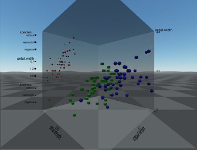

```{r setup, include=FALSE}
# read in shiny example for output below
knitr::read_chunk(
  system.file("shiny-example", "iris-app.R", package = "shinyaframe"),
  labels = "shinyappexample", from.offset = 2, to.offset = -1
)
```

`shinyaframe` provides a bridge between R and 
Web-based Virtual Reality (WebVR)
experiences using
[RStudio Shiny](https://www.rstudio.com/products/shiny-2/) and
[Mozilla's A-Frame WebVR framework](https://aframe.io).
WebVR is a cross-platform standard that allows the same
content to be delivered to desktop monitors as a 2D projection, 
to mobile phones as a 360-degree 3D experience, and to high-end
virtual reality systems as an immersive, hands-on virtual reality experience.

## Building Blocks

The [gg-aframe JavaScript package](https://github.com/wmurphyrd/gg-aframe),
also from this package's author, is included in `shinyaframe` and
provides a declarative "Grammar of Graphics" style HTML
syntax for constructing 3-Dimensional data visualizations for WebVR. An example
of that syntax for a basic scatter plot is shown below; refer to the link above
for complete documentation. 

```html
<a-scene>
  <!-- position and rotation set the plot location in 3D space -->
  <a-entity plot scale-shape position="0 1.6 -1.38" rotation="0 35 0">
    <a-entity layer-point 
      data-binding__sepal.length="target: layer-point.x"
      data-binding__sepal.width="target: layer-point.y"
      data-binding__petal.length="target: layer-point.z"
      data-binding__species="target: layer-point.shape"
      data-binding__petal.width.size="target: layer-point.size">
    </a-entity>
  </a-entity>
</a-scene>
```

The `data-binding` attributes in the `gg-aframe` map from a central
data repository to the aesthetic properties of the plot components, and this
is where `shinyaframe` applies. The `aDataScene` function takes as input
data from R and adds it to the `data-binding` repository
using the `htmlwidgets` R package. 
Repeat calls will update the repository and the plot so that
interactive visualizations are simple to implement in a Shiny app.

The example below shows the R code to provide the data for the `gg-aframe`
plot above. Note that variables mapped to position and size are scaled
in R before sending to `gg-aframe` whereas shape is not. In the plot
specification, the `scale-shape` attribute enables `gg-aframe` to take
raw input data for shape and map it to a polyhedral scale. 

```{r, eval=FALSE}
library(dplyr)
library(scales)
library(shinyaframe)

names(iris) <- tolower(names(iris))
iris %>%
  # scale positional data to (0,1)
  mutate_if(is.numeric, rescale) %>%
  # scale size data to relative percentage
  mutate(petal.width.size = rescale(petal.width, to = c(0.5, 2))) %>%
  aDataScene()
```

## Creating a WebVR Shiny App

Shiny provides the glue to connect the HTML and R in the above examples. 
The Shiny app `ui` will create the HTML `gg-aframe` syntax, and the `server`
will transform and send the data. The Shiny binding functions in
`shinyaframe` are `aDataSceneOuput` for the `ui`,
which will take all additional `gg-aframe` syntax as arguments, 
and `renderADataScene` for the `server`, which will process the data and
return a call to `aDataScene`. Also included in `shinyaframe` are
functions to render
the custom HTML elements used by A-Frame and `gg-aframe` from a ui
written in R, and they are exported in the `atags` list for convenient access.

The example below creates an iris data 3D scatterplot 
in a Shiny app. In addition to the code from the examples above,
it also includes mapping and output for the axes and legend
guides.

```{r shinyappexample, eval=FALSE}

```

The output of this Shiny app would appear as below:



You can run this example to view the interactive version
by calling `example("shinyaframe")` 
(open the app in a Web browser; it will not function in the RStudio viewer).

